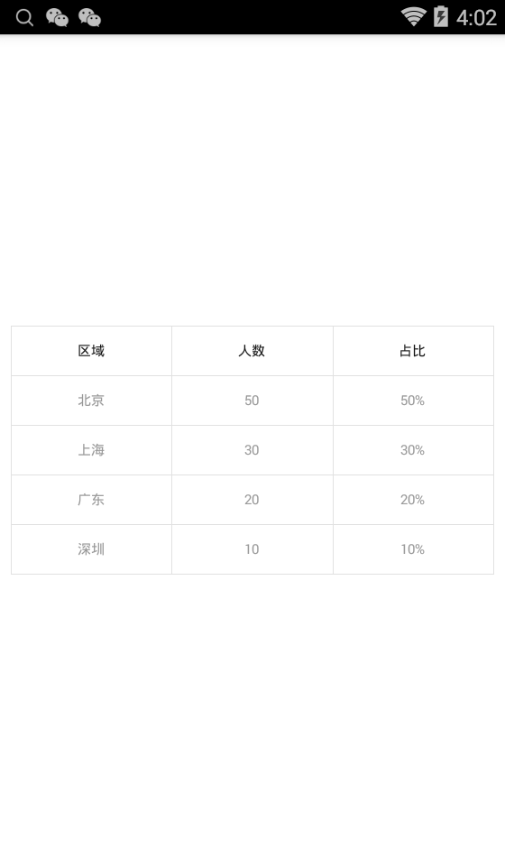

## 表格控件
### 使用场景
> 用于展示简单的统计数据

### 实现功能
    <com.smartown.tableview.library.TableView
        android:id="@+id/table"
        android:layout_width="wrap_content"
        android:layout_height="wrap_content"
        android:layout_centerInParent="true"
        android:layout_margin="8dp"
        app:dividerColor="#e1e1e1"
        app:dividerWidth="1px"
        app:headerColor="#00ffffff"
        app:headerTextColor="#111111"
        app:headerTextSize="10dp"
        app:rowHeight="36dp"
        app:textColor="#999999"
        app:textSize="10dp"
        app:unitColumnWidth="0dp" />

属性名|含义|默认值|备注
---|---|---|---
dividerColor|分割线颜色|#e1e1e1
dividerWidth|分割线宽度|1px
headerColor|表头背景颜色|透明
headerTextColor|表头文字颜色|#111111
headerTextSize|表头文字大小|10dp
rowHeight|单元格高度|36dp
textColor|表格内容文字颜色|#999999
textSize|表格内容文字大小|10dp
unitColumnWidth|单元格宽度|0dp|为0时会自动根据列数得分屏幕宽度

### 使用方法
    tableView.clearTableContents()
                    .setHeader("区域", "人数", "占比")
                    .addContent("北京", "50", "50%")
                    .addContent("上海", "30", "30%")
                    .addContent("广东", "20", "20%")
                    .addContent("深圳", "10", "10%")
                    .refreshTable();
### 效果展示
